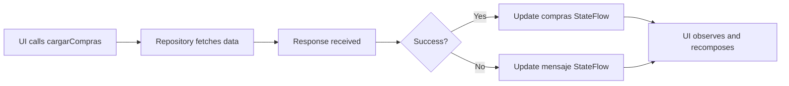

# ComprasViewModel

The `ComprasViewModel` manages the display and retrieval of user purchase history.

## Overview

This ViewModel handles:
- Loading purchase records from the API
- Managing purchase list state
- Error handling and messaging

Located at: `ui/viewmodel/ComprasViewModel.kt`

## Properties

### compras

List of all purchases retrieved from the API.

```kotlin
val compras: StateFlow<List<Compra>>
```

Each `Compra` contains:
- Purchase transaction details
- Purchase date
- Associated user
- List of ticket instances (CompraEntrada)

### mensaje

Status or error message from the last operation.

```kotlin
val mensaje: StateFlow<String>
```

**Possible values:**
- `""` - No message (successful operation)
- `"Error al obtener compras: {code}"` - HTTP error with code
- `"Sin conexión a internet"` - Network connectivity issue

## Methods

### cargarCompras

Retrieves all purchases from the API.

```kotlin
fun cargarCompras()
```

**Behavior:**
1. Calls `ComprasRepository.obtenerCompras()`
2. On success:
   - Updates `compras` StateFlow with response body
   - Clears error message
3. On failure:
   - Sets error message with HTTP status code
   - Handles network exceptions

**Example usage:**

```kotlin ComprasScreen.kt
@Composable
fun ComprasScreen(
    navController: NavController,
    viewModel: ComprasViewModel
) {
    val compras by viewModel.compras.collectAsState()
    val mensaje by viewModel.mensaje.collectAsState()

    LaunchedEffect(Unit) {
        viewModel.cargarCompras()
    }

    if (mensaje.isNotEmpty()) {
        Text(mensaje, color = MaterialTheme.colorScheme.error)
    }

    LazyColumn {
        items(compras) { compra ->
            CompraCard(compra = compra)
        }
    }
}
```

## Error Handling

The ViewModel handles errors gracefully:

```kotlin
try {
    val response = repository.obtenerCompras()
    if (response.isSuccessful) {
        _compras.value = response.body() ?: emptyList()
        _mensaje.value = ""
    } else {
        _mensaje.value = "Error al obtener compras: ${response.code()}"
    }
} catch (e: Exception) {
    _mensaje.value = "Sin conexión a internet"
}
```

<Note>
  Network errors are caught and converted to user-friendly messages in Spanish.
</Note>

## Usage Pattern

Typical usage in a Composable screen:

```kotlin
val viewModel: ComprasViewModel = viewModel(
    factory = viewModelFactory {
        initializer { ComprasViewModel() }
    }
)

LaunchedEffect(Unit) {
    viewModel.cargarCompras()
}
```

## Integration with UI

### ComprasScreen

The ComprasViewModel is used in `ComprasScreen.kt` to display purchase history:

```kotlin ComprasScreen.kt
@Composable
fun ComprasScreen(
    navController: NavController,
    viewModel: ComprasViewModel
) {
    val compras by viewModel.compras.collectAsState()
    val mensaje by viewModel.mensaje.collectAsState()
    val context = LocalContext.current

    // Load purchases on screen entry
    LaunchedEffect(Unit) {
        viewModel.cargarCompras()
    }

    Scaffold(
        topBar = {
            TopAppBar(
                title = { Text("Mis Compras") },
                navigationIcon = {
                    IconButton(onClick = { navController.popBackStack() }) {
                        Icon(Icons.Default.ArrowBack, "Volver")
                    }
                }
            )
        }
    ) { padding ->
        Column(modifier = Modifier.padding(padding)) {
            // Error message display
            if (mensaje.isNotEmpty()) {
                Card(
                    colors = CardDefaults.cardColors(
                        containerColor = MaterialTheme.colorScheme.errorContainer
                    )
                ) {
                    Text(mensaje, modifier = Modifier.padding(16.dp))
                }
            }

            // Purchase list
            if (compras.isEmpty()) {
                Text(
                    "No hay compras registradas",
                    modifier = Modifier.padding(16.dp)
                )
            } else {
                LazyColumn {
                    items(compras) { compra ->
                        PurchaseCard(compra)
                    }
                }
            }
        }
    }
}
```

## State Management

The ViewModel follows unidirectional data flow:



## Related

- [Compras API Service](/api/compras)
- [Compra Model](/api/models/compra)
- [CompraEntrada Model](/api/models/compra#compraentrada)
