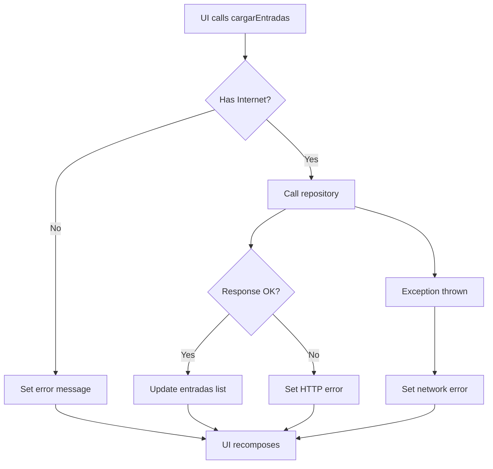

# EntradasApiViewModel

The `EntradasApiViewModel` manages the display and retrieval of available event tickets from the API.

## Overview

This ViewModel handles:
- Loading available tickets from the API
- Network connectivity checking
- Error handling and messaging
- Ticket list state management

Located at: `ui/viewmodel/EntradasApiViewModel.kt`

## Properties

### entradas

List of all available tickets retrieved from the API.

```kotlin
val entradas: StateFlow<List<Entrada>>
```

Each `Entrada` contains:
- Event title and location
- Price and availability status
- Unique ticket identifier
- QR code (if purchased)

### mensaje

Status or error message from the last operation.

```kotlin
val mensaje: StateFlow<String>
```

**Possible values:**
- `""` - No message (successful operation)
- `"Sin conexion a internet"` - No network connectivity
- `"Error: {code}"` - HTTP error with status code
- `"Error de red"` - Network exception occurred

## Methods

### cargarEntradas

Retrieves available tickets from the API.

```kotlin
fun cargarEntradas(hasInternet: Boolean)
```

<ParamField path="hasInternet" type="Boolean">
  Network connectivity status from the UI layer
</ParamField>

**Behavior:**
1. Checks network connectivity parameter
2. If no internet:
   - Sets error message
   - Returns without API call
3. If internet available:
   - Calls `EntradasRepository.obtenerEntradas()`
   - On success: Updates `entradas` StateFlow
   - On failure: Sets appropriate error message

**Example usage:**

```kotlin HomeScreen.kt
@Composable
fun HomeScreen(
    navController: NavController,
    viewModel: EntradasApiViewModel
) {
    val entradas by viewModel.entradas.collectAsState()
    val mensaje by viewModel.mensaje.collectAsState()
    val hasInternet = rememberNetworkStatus()

    LaunchedEffect(hasInternet) {
        if (hasInternet) {
            viewModel.cargarEntradas(hasInternet)
        }
    }

    if (mensaje.isNotEmpty()) {
        Text(mensaje, color = MaterialTheme.colorScheme.error)
    }

    LazyColumn {
        items(entradas) { entrada ->
            EntradaCard(entrada = entrada) {
                // Navigate to ticket detail
                navController.navigate("${Routes.DETALLE}/${entrada.codigoQR}")
            }
        }
    }
}
```

## Network Handling

The ViewModel requires the UI to pass network connectivity status:

```kotlin
fun cargarEntradas(hasInternet: Boolean) {
    viewModelScope.launch {
        if (!hasInternet) {
            _mensaje.value = "Sin conexion a internet"
            return@launch
        }

        try {
            val response = repository.obtenerEntradas()
            if (response.isSuccessful) {
                _entradas.value = response.body() ?: emptyList()
            } else {
                _mensaje.value = "Error: ${response.code()}"
            }
        } catch (e: Exception) {
            _mensaje.value = "Error de red"
        }
    }
}
```

<Note>
  Unlike other ViewModels, this one takes network status as a parameter rather than checking internally. This design allows the UI to control when network checks occur.
</Note>

## Integration with HomeScreen

The EntradasApiViewModel powers the main ticket browsing interface:

```kotlin HomeScreen.kt
@Composable
fun HomeScreen(
    navController: NavController,
    carritoViewModel: CarritoViewModel
) {
    val viewModel = remember { EntradasApiViewModel() }
    val entradas by viewModel.entradas.collectAsState()
    val context = LocalContext.current

    // Network status monitoring
    var hasInternet by remember { mutableStateOf(true) }

    DisposableEffect(Unit) {
        val callback = object : ConnectivityManager.NetworkCallback() {
            override fun onAvailable(network: Network) {
                hasInternet = true
                viewModel.cargarEntradas(true)
            }
            override fun onLost(network: Network) {
                hasInternet = false
            }
        }
        // Register network callback
        // ...
        onDispose { /* Unregister */ }
    }

    // Initial load
    LaunchedEffect(Unit) {
        viewModel.cargarEntradas(hasInternet)
    }

    // Pull to refresh
    SwipeRefresh(
        onRefresh = { viewModel.cargarEntradas(hasInternet) }
    ) {
        LazyColumn {
            items(entradas.filter { it.estado == "disponible" }) { entrada ->
                EntradaCard(
                    entrada = entrada,
                    onAgregarClick = {
                        carritoViewModel.agregar(entrada, 1)
                    }
                )
            }
        }
    }
}
```

## Error Handling

Three types of errors are handled:

### No Internet Connection
```kotlin
if (!hasInternet) {
    _mensaje.value = "Sin conexion a internet"
    return@launch
}
```

### HTTP Errors
```kotlin
if (!response.isSuccessful) {
    _mensaje.value = "Error: ${response.code()}"
}
```

Common HTTP codes:
- `400` - Bad request
- `401` - Unauthorized
- `404` - Not found
- `500` - Server error

### Network Exceptions
```kotlin
catch (e: Exception) {
    _mensaje.value = "Error de red"
}
```

## State Management

The ViewModel maintains a simple state flow:



## Usage Pattern

Typical initialization in MainActivity:

```kotlin MainActivity.kt
val entradasApiViewModel = remember { EntradasApiViewModel() }

NavGraph(
    navController = navController,
    entradasApiViewModel = entradasApiViewModel,
    // ... other ViewModels
)
```

## Related

- [Entradas API Service](/api/entradas)
- [Entrada Model](/api/models/entrada)
- [Tickets Feature](/features/tickets)
- [Shopping Cart ViewModel](/api/viewmodels/carrito)
